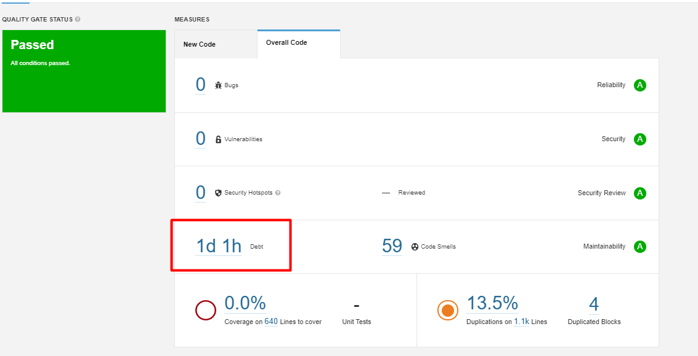
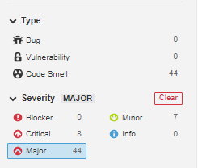
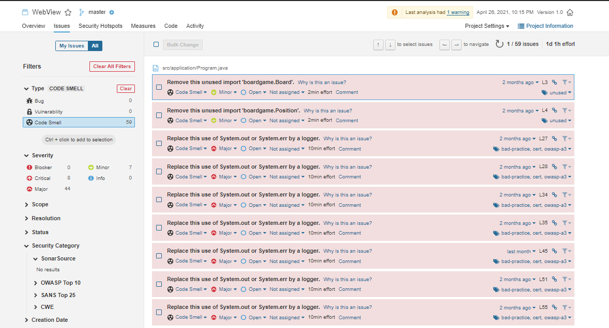
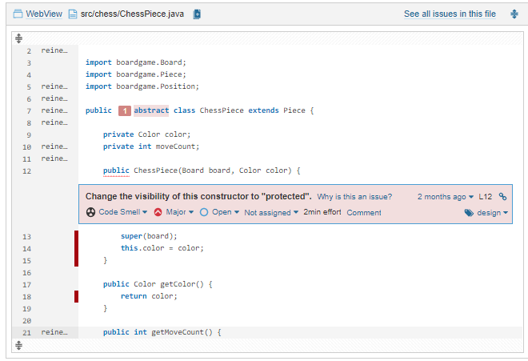
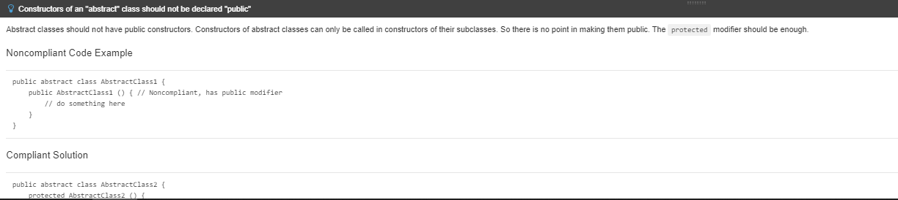
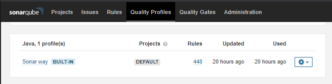
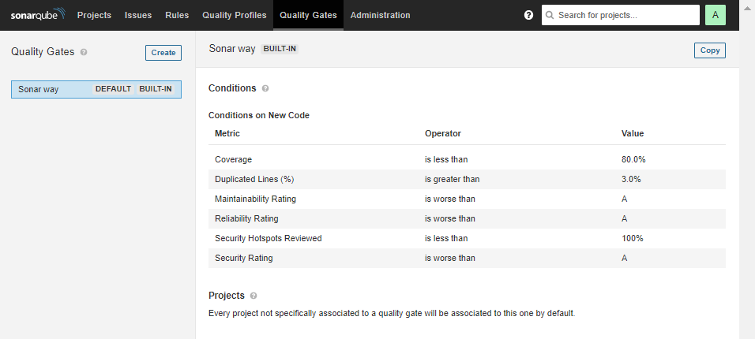

## Guia de como utilizar o SonarQube em ambiente local no Windows.

#### 1º Passo: É necessario instalar o [Java SE 11 ou superior](https://www.oracle.com/br/java/technologies/javase-downloads.html).

-----
#### 2º Passo: Baixar a última versão do [SonarQube Community](https://www.sonarqube.org/downloads/) e extrair os arquivos para C:/SonarQube 

-----
#### 3º Passo: Baixar a última versão versão [SonarScanner](https://docs.sonarqube.org/latest/analysis/scan/sonarscanner/) e extrair os aarquivos para C:/SonarScanner.

-----
#### 4º Passo: Para que nosso projeto possa ser analisado pelo SonarQube precisamos  adicionar um arquivo de configuração na raiz do nosso projeto.

O arquivo deverá chamar: sonar-project.propeties
 A seguinte configuração deverá estar presente no arquivo:

----
#### 5º Passo: Você poderá iniciar o SonarQube manualmetne ou então instalar como um serviço:
>Manualmente:
Execute o CMD como administrador.
Navegue até a pasta onde se encontra o executor do SonarQube
Ex: C:\SonarQube\bin\windows-x86-64
Execute o arquivo StartSonar.bat
Neste momento, o site do SonarQube ficará disponível na porta http://localhost:9000/

Ao acessar localhost:9000, deverá entrar com: 
##### LOGIN: **admin**
##### SENHA: **admin**

------
#### 6º Você pode iniciar a analise do seu projeto com o SonarScanner:
>Executar a analise:
Execute um novo CMD como administrador.
Navegue até a pasta do projeto onde está o seu .sln junto com seu arquivo de configuração.
Ex.: cd C:\Projetos\MeuProjeto
Dentro da pasta de seu projeto digite o caminho:
C:\SonarScanner\bin\sonar-scanner.bat
Para de o caminho até o arquivo sonar-scanner.bat
Após executar o scanner, o processo de analise do projeto será executado. O resultado de saida irá aparecer no site do SonarQube disponível na porta http://localhost:9000/ 

----

#### Qualidade contítua do código: Sonar avalia os riscos do projeto com base na confiabilidade, segurança e manutenção.

*Confiabilidade -> Incidência de bugs*
*Segurança -> Incidência de vulnerabilidades*
*Manutenção -> Incidência de code smells*
*% de linhas cobertas com teste unitário*
*% de código duplicado*

----

### Ao Entrar no projeto pelo localhost:9000 essa será a tela apresentada após fazer o "Scan" de seu projeto.

-----
### Após clicar no título do projeto terá uma visão mais detalhada  dos dados

##### Code Smells: Para cada problema no código o SonarQube realiza um cálculo que resulta  no total de tempo de divida técnica do projeto. Como visto na foto acima nosso projeto tem um total de 1 dia e 1 hora de débito técnico, esse valor corresponde aos 59 code smells.
----

### Na guia "Problems" é possível filtrar os problemas do projeto de acordo com o seu tipo.

Ao selecionar um filtro ele nos indica onde o problema ocorre no código e qual o seu nível de gravidade.

Quando filtramos por "Gravidade" obtemos informações de quem realizou aquela atividade e tempo de esforço para solucionar o problema.

Ao clicarmos sobre o item desejado seremos direcionados a parte do código onde o problema se encontra.

Ao clicarmos em "Why is this an issue?" somos direcionados para a solução do erro.

-----
### Na guia "Rules" estão disponíveis as regras de varias linguagens, é através dessas regras que o SonarQube realiza a analise do código.

----
### Em perfil de qualidade se pode alterar as regras ou criar suas próprias.

----
### Metas de qualidade é o local onde é definido os parametros para  aprovação do código

--------

